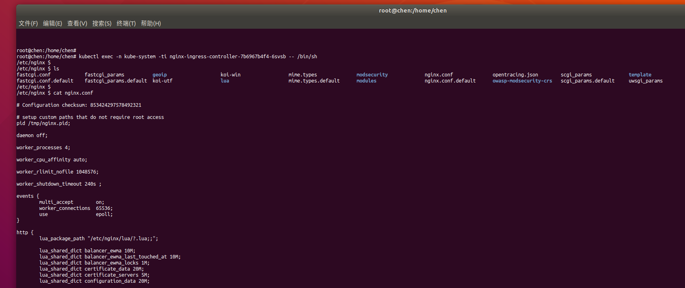

#开源社区和商业社区Nginx
    梳理高性能HTTP和反向代理web服务器Nginx概念,开源社区与商业社区关系,以及和云产品(阿里云ACK组件Nginx Ingress Controller)的关联, 同时记录Kubernetes中ingress等配置文档入口.

## 关系
- nginx-ingress-controller = nginx + nginx plus
```text
nginx-ingress-controller是受信任的NGINX开源和NGINX Plus软件负载均衡器与自动配置的相结合
NGINX Plus包含有关NGINX开源软件的所有优点，并添加了企业级功能(例如高可用性，活动的运行状况检查，DNS系统发现，会话持久性和RESTful API)
```
   [nginx-ingress-controller-kubernetes官网地址截图](./img/nginx-ingress-controller-kubernetes.png)
    
   [nginx-plus官网地址截图](./img/nginx-plus.png)

- 官网访问入口

域名nginx.org是[开源社区](http://nginx.org/)，管理着Nginx开源版

域名nginx.com是[商业社区](https://www.nginx.com/)，管理着Nginx Plus商业版; 产品有: [nginx-ingress-controller](https://www.nginx.com/resources/datasheets/nginx-ingress-controller-kubernetes/)等

[nginx开源社区官网截图](./img/nginx-org.png)

[nginx商业社区官网截图](./img/nginx-com.png)

## 阿里云K8S负载均衡nginx-ingress-controller
- 关系
```text
阿里云ACK nginx-ingress-controller = 社区版Nginx Ingress Controller + 优化定制版
```

- 说明(根据ingress资源动态更新nginx配置文件)
```text
当前Kubernetes官方维护的是Nginx Ingress Controller, 阿里云ACK基于社区版的Nginx Ingress Controller进行了优化的定制版组件
Ingress Controller通过API Server获取Ingress资源的变化，动态地生成Load Balancer（例如Nginx）所需的配置文件（例如nginx.conf），然后重新加载Load Balancer（例如执行nginx -s load重新加载Nginx。）来生成新的路由转发规则
```

- 文档查看攻略

    [1.阿里云Ingress说明文档](https://help.aliyun.com/document_detail/198892.html?spm=a2c4g.11186623.6.773.37482de7JNIayJ)
    
    [2.阿里云K8S集群组件文档>应用管理>运维>组件管理](https://cs.console.aliyun.com/#/k8s/cluster/list)    [页面截图](./img/aliyun-k8s-ack-component.png)
    
    [3.1.ingress官网地址](https://kubernetes.github.io/ingress-nginx/)
    
    [3.2.ingress社区github地址](https://github.com/kubernetes/ingress-nginx)
    
    [4.配置文档地址](https://github.com/kubernetes/ingress-nginx/tree/master/docs/user-guide)
    
    [4.1配置文档地址之annotations配置项](https://github.com/kubernetes/ingress-nginx/blob/master/docs/user-guide/nginx-configuration/annotations.md) [页面截图](./img/ingress-config-annotations.png)
    
    
    
- Kubernetes中Service、Ingress与Ingress Controller关系
```yaml
Service: 后端真实服务
Ingress: 反向代理规则
Ingress-Controller: 反向代理程序,负责解析Ingress的反向代理规则
```

- 查看nginx-ingress-controller配置文件
```text
1.进入容器POD命令
    kubectl -n kube-system get pod
    kubectl exec -n kube-system -ti nginx-ingress-rd-controller-6b5cfc9dcc-dpzbc -- /bin/sh
2.从远程复制到本地命令(本地需创建空nginx.conf)
    kubectl -n kube-system  cp nginx-ingress-controller-7b6967b4f4-6svsb:/etc/nginx/nginx.conf /home/chen/data/aliyun/nginx.conf
```



